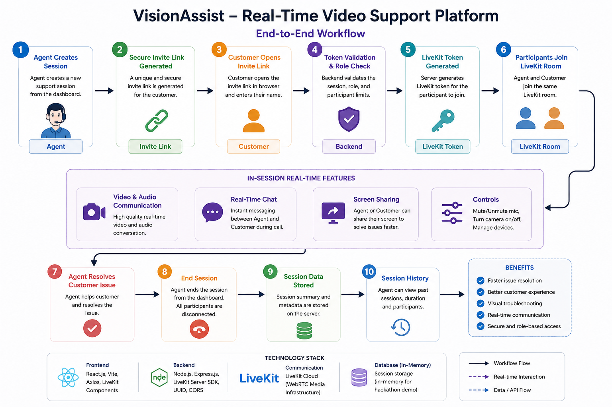

# VisionAssist – Real-Time Video Support Platform

## Overview

VisionAssist is a browser-based real-time video support platform built for **AtomQuest Hackathon 2026**.

It helps customer support agents resolve visual issues by allowing them to create secure video support sessions, invite customers using a link, communicate through audio/video, chat in real time, share screens, end sessions, and view session history.

---

## Live Demo

### Frontend

https://vision-assist-eight.vercel.app

### Backend API

https://visionassist-backend-zck7.onrender.com

### GitHub Repository

https://github.com/Parv-Gpu/VisionAssist

---

## Workflow

<p align="center">
  
</p>

---

## Features

- Agent can create a support session
- Customer joins using secure invite link
- One Agent + One Customer per session
- Browser-based video calling
- Audio calling
- Mute / unmute microphone
- Turn camera on / off
- Real-time in-call chat
- Screen sharing
- End session functionality
- Session history tracking
- Role-based access control
- Duplicate customer/agent join prevention

---

## Tech Stack

### Frontend

- React.js
- Vite
- Axios
- React Router
- LiveKit React Components

### Backend

- Node.js
- Express.js
- LiveKit Server SDK
- UUID
- dotenv
- CORS

### Communication

- WebRTC
- LiveKit Cloud

### Deployment

- Vercel
- Render

---

## Project Structure

```text
vision_assist/
│
├── backend/
│   ├── server.js
│   ├── package.json
│   ├── package-lock.json
│   └── .env
│
├── frontend/
│   ├── public/
│   ├── src/
│   │   ├── pages/
│   │   │   ├── AgentPage.jsx
│   │   │   ├── CustomerPage.jsx
│   │   │   └── CallRoom.jsx
│   │   ├── App.jsx
│   │   ├── main.jsx
│   │   ├── App.css
│   │   └── index.css
│   ├── package.json
│   ├── vite.config.js
│   └── vercel.json
│
├── .gitignore
└── README.md
```

---

## Architecture

```text
Agent Browser
      |
      v
React Frontend
      |
      | REST APIs
      v
Node.js Backend
(Session Manager + Token Generator)
      |
      v
LiveKit Cloud
(WebRTC Media Layer)
      ^
      |
Customer Browser
```

---

## Setup Instructions

### 1. Clone Repository

```bash
git clone https://github.com/Parv-Gpu/VisionAssist.git
cd VisionAssist
```

### 2. Backend Setup

```bash
cd backend
npm install
```

Create `.env` inside `backend/`:

```env
PORT=5000
LIVEKIT_URL=your_livekit_url
LIVEKIT_API_KEY=your_api_key
LIVEKIT_API_SECRET=your_api_secret
```

Run backend:

```bash
npm run dev
```

### 3. Frontend Setup

```bash
cd frontend
npm install
npm run dev
```

---

## Demo Flow

1. Open the Agent Dashboard.
2. Click **Create Support Session**.
3. Copy/open the generated customer invite link.
4. Customer enters name and joins the call.
5. Agent clicks **Join as Agent**.
6. Both participants join the same video room.
7. Test video and audio communication.
8. Exchange messages using real-time chat.
9. Test screen sharing.
10. Agent clicks **End Session**.
11. Both users disconnect.
12. Agent views session history.

---

## API Endpoints

### Create Session

```http
POST /api/sessions/create
```

### Generate LiveKit Token

```http
POST /api/livekit/token
```

### End Session

```http
POST /api/sessions/:id/end
```

### View Session History

```http
GET /api/sessions/:id/history
```

---

## Access Control

| Role | Permissions |
|---|---|
| Agent | Create session, join call, end session, view history |
| Customer | Join only through valid invite link |
| Unauthorized User | Access denied |

---

## Functional Requirements Coverage

| Requirement | Status |
|---|---|
| Agent creates session | Completed |
| Customer joins through invite link | Completed |
| Browser-based video call | Completed |
| Audio calling | Completed |
| Server-routed media | Completed |
| Mute / Unmute | Completed |
| Camera On / Off | Completed |
| Real-time chat | Completed |
| Screen sharing | Completed |
| Role-based access | Completed |
| End session | Completed |
| Session history | Completed |

---

## Known Limitations

- Session data is stored in backend memory.
- Data resets when backend server restarts.
- Recording is not implemented.
- File sharing is not implemented.
- Current version supports one agent and one customer.
- Free-tier backend may take a few seconds to wake up after inactivity.

---

## Future Improvements

- Persistent database storage
- Call recording
- File sharing
- Admin dashboard
- Analytics and observability
- AI-powered call summaries
- Multi-agent support
- Session reports
- Self-hosted LiveKit deployment

---

## Author

### Parv Gupta

B.Tech Electrical Engineering  
Sardar Vallabhbhai National Institute of Technology (SVNIT), Surat

GitHub: https://github.com/Parv-Gpu

---

## Hackathon Details

**Event:** AtomQuest Hackathon 2026  
**Problem Statement:** Real-Time Video Support Platform  
**Built By:** Parv Gupta  
**Live Demo:** https://vision-assist-eight.vercel.app  
**Backend API:** https://visionassist-backend-zck7.onrender.com  
**GitHub Repository:** https://github.com/Parv-Gpu/VisionAssist
